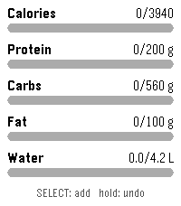

# My Macros

A Pebble watchapp for tracking daily macros — protein, carbs, fat, and water —
right from your wrist. Designed for fast, glanceable logging with no phone
required.



## Features

- **Dashboard** with progress bars for calories, protein, carbs, fat, and water
- **Calories computed automatically** from macros (4/4/9 kcal per gram)
- **Quick logging**: press SELECT, pick a macro, dial in the amount, log it
- **Fine mode**: hold SELECT in the amount picker to switch between coarse and
  fine increments (e.g. ±10 g vs ±1 g, or ±0.5 L vs ±0.1 L for water)
- **Undo**: hold SELECT on the dashboard to revert the last entry
- **Daily reset**: totals roll over automatically at midnight
- Totals persist across app restarts using watch storage

## Goals

Daily targets are compile-time constants in `src/c/my-macros.c`:

| Macro   | Goal   |
| ------- | ------ |
| Protein | 200 g  |
| Carbs   | 560 g  |
| Fat     | 100 g  |
| Water   | 4.2 L  |

Edit the `GOAL_*` defines to match your own targets.

## Building & running

Requires the [Pebble SDK](https://developer.repebble.com) (`pebble-tool`).

```sh
pebble build                          # build the app
pebble install --emulator emery       # run on the Pebble Time 2 emulator
pebble install --phone <ip>           # install to a watch via the phone app
```

The app targets **emery** (Pebble Time 2); add other platforms to
`targetPlatforms` in `package.json` if needed.

## Controls

| Screen    | Input          | Action                          |
| --------- | -------------- | ------------------------------- |
| Dashboard | SELECT         | Open the macro picker           |
| Dashboard | hold SELECT    | Undo last entry                 |
| Picker    | SELECT         | Choose macro                    |
| Amount    | UP / DOWN      | Adjust amount                   |
| Amount    | SELECT         | Log it and return to dashboard  |
| Amount    | hold SELECT    | Toggle fine/coarse increments   |

## License

[MIT](LICENSE)
